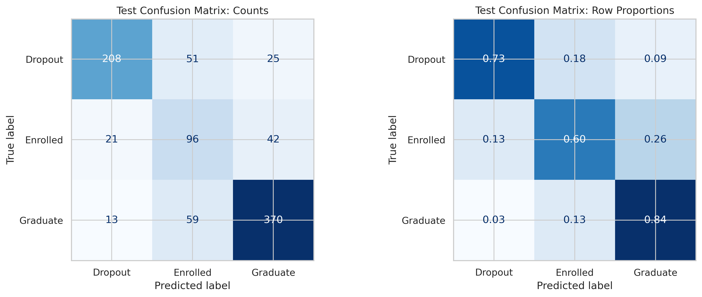

# Student Dropout and Academic Success

A reproducible capstone by **Al Christian Gobres** examining three student outcomes: Dropout, Enrolled, and Graduate. The project compares classifiers, tests feature representations, and audits differences in errors across student groups.

**Scope:** retrospective classification using information through the second semester. This is not an enrollment-only model or a validated operational early-warning system.

## Results at a glance

| Submitted result | Value |
|---|---:|
| Dataset | 4,424 students, 36 original predictors |
| Split | 2,654 training / 885 validation / 885 test |
| Selected configuration | Random forest, full features |
| Training CV macro F1 | 0.710 |
| Validation macro F1 | 0.729 |
| Test macro F1 | 0.720 |
| Test accuracy | 76.2% |
| Dropout recall | 73.2% (208 / 284) |
| Enrolled recall | 60.4% (96 / 159) |

**Verification:** a fresh full run completed locally and selected the same configuration, with test macro F1 **0.7158** and accuracy **0.7593**. Exact historical predictions were not reproduced; see [VERIFICATION.md](VERIFICATION.md).

These are the author's submitted reference results. Newly generated results are kept separately. Logistic regression was nearly tied in cross-validation; the small ranking difference does not establish statistical superiority.



## Repository map

```text
src/student_dropout/     Reproduction script, feature engineering, audit helpers
notebooks/               Clean report notebook and technical slideshow
data/                   Public UCI data, dictionary and attribution
models/                  Model documentation; generated binaries ignored
reports/final_report.html  Readable report with submitted outputs
reports/final_report.ipynb  Report snapshot with submitted outputs
reports/reference/       Submitted metrics, fairness tables and figures
reports/generated/       Fresh local outputs (ignored by Git)
presentations/           Business PowerPoint and PDF
tests/                   Integrity and transformation tests
```

## Quick start (Anaconda)

From the repository root:

```bash
conda create -n student-dropout python=3.13 -y
conda activate student-dropout
python -m pip install -r requirements.txt
python -m pip install --no-deps -e .
python -m pytest -q
```

The data is included with attribution, so reproduction does not require downloading it or scraping UCI. The dependency versions match the locally available Anaconda runtime used for verification; they are not a claim about the historical environment used for every submitted artifact.

### Reproduce the complete analysis

```bash
MPLBACKEND=Agg python -m student_dropout.workflow
```

On Windows PowerShell, set `$env:MPLBACKEND="Agg"` before running the Python command. The full run includes EDA, ten model/representation experiments, five-fold grid searches, final refitting, evaluation, PDP/ICE, and group fairness metrics. It can take several minutes or longer depending on hardware. GridSearchCV uses two workers; adjust `N_JOBS` in the script if needed.

Outputs are written to `reports/generated/workflow/`. The fitted model bundle is saved to `models/final_pipeline.joblib`.

```bash
python -m student_dropout.fairness_summary --input reports/generated/workflow/ethical_ai_outputs/fairness_group_metrics_all_outcomes.csv --output reports/generated/workflow/ethical_ai_outputs/fairness_summary_all_outcomes.csv
```

### Use Jupyter instead

Open `notebooks/dropout_prediction_report.ipynb` in Anaconda's Jupyter application. Select the environment above and **Restart Kernel and Run All Cells**. The first cell locates the repository; generated notebook outputs go to `reports/generated/notebook/`. The cleaned notebook and script implement the same modelling choices and import the same feature transformation function.

The technical deck is `notebooks/technical_presentation.ipynb`; slideshow metadata is retained. Its image links point to the checked-in reference figures. The business deck is in `presentations/`.

## Methodology

- Fixed stratified 60:20:20 split, seed 42; all three outcomes retained.
- Separate target encoding; Target never enters the predictors.
- Median imputation and scaling for numerical features; categorical imputation and one-hot encoding with rare-category grouping.
- Semester approval/evaluation ratios, zero-enrollment indicators, age groups and changes in academic progress.
- Undefined zero-denominator ratios remain missing until training-fitted imputation. Ratios above one are investigated and retained, not silently clipped.
- Dummy, logistic regression, random forest, gradient boosting and RBF SVM candidates; full, embedded-selected and PCA representations where specified.
- Preprocessing, embedded selection and PCA fitted inside each CV fold. Selection uses mean CV macro F1; the fixed winner is refitted on training + validation before test evaluation.
- PDP/ICE explanations and one-versus-rest fairness metrics for all outcomes.

## Limitations and responsible use

The Enrolled class remains difficult to distinguish. Whole-dataset EDA preceded splitting, so human choices were not completely isolated from the test set. The test set has since been examined and audited: do not tune mitigation or thresholds against it and then claim a new unbiased test result. Use new cohorts for future evaluation.

Academic and financial timestamps must be verified before prospective use. Correlated inputs limit interpretation of permutation importance and PDP/ICE. Fairness differences are descriptive and do not establish causation or legal conclusions; small group denominators produce uncertainty. Race is unavailable, and financial features are imperfect socioeconomic proxies. Use the work for research and voluntary support design, with human review; no automated exclusion, funding or disciplinary decisions. Intervention impact and ROI were not measured.

## Data, licensing and citation

Source: [UCI dataset 697](https://archive.ics.uci.edu/dataset/697/predict+students+dropout+and+academic+success), [DOI 10.24432/C5MC89](https://doi.org/10.24432/C5MC89). Dataset: CC BY 4.0; see [data attribution](data/README.md).

Project code is MIT licensed. The dataset retains its original license. See [CONTRIBUTING.md](CONTRIBUTING.md), [MODEL_CARD.md](MODEL_CARD.md) and [PUBLISHING.md](PUBLISHING.md).
